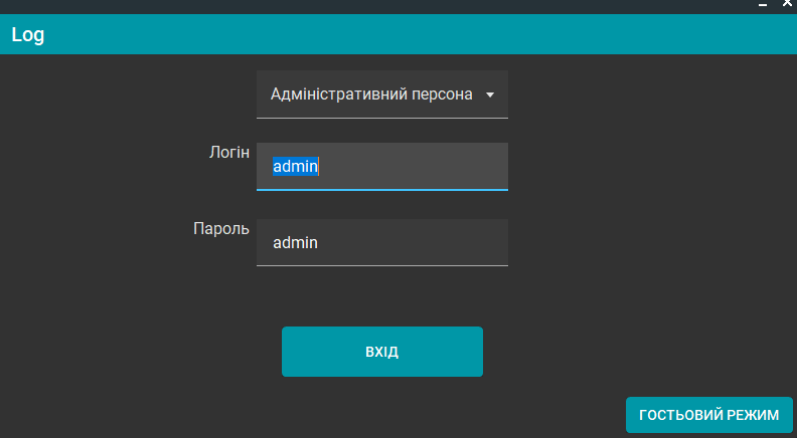
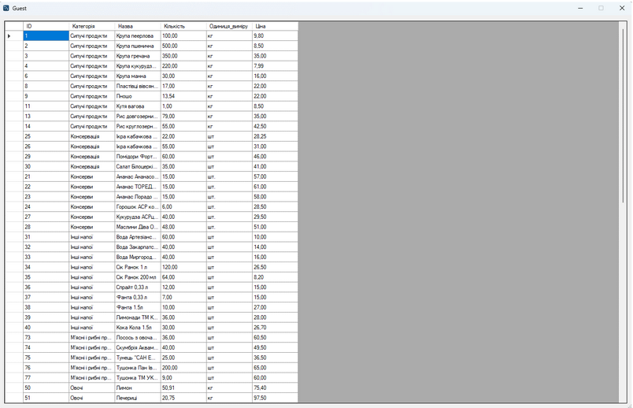
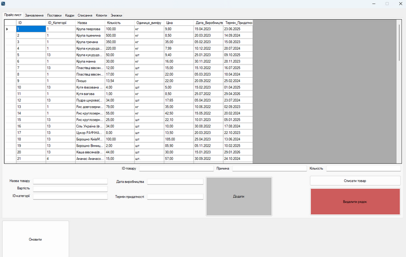

# Inventory Management System (C#)

A basic inventory and warehouse management system developed in C# as a university course project.  
The system manages products, suppliers, clients and orders, and includes stock tracking and expiry date control.

## Screenshots

### Main Window

### Product Management

### Order Management

